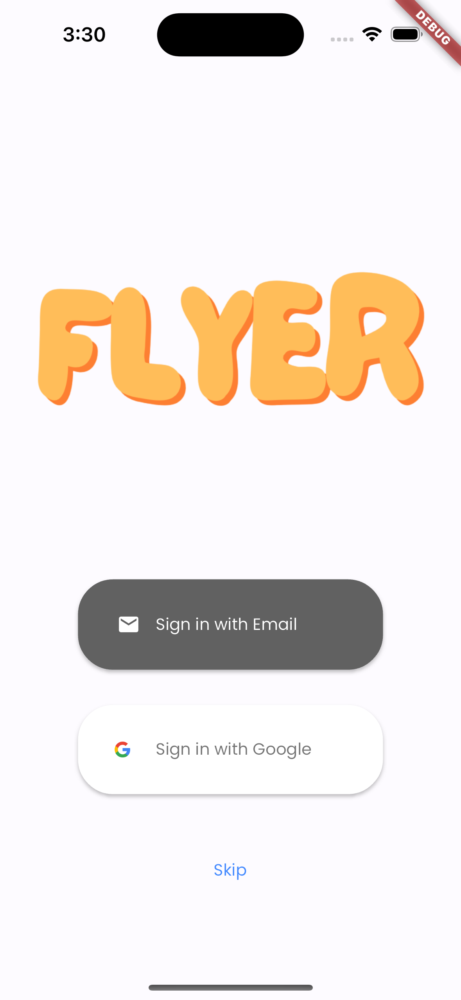
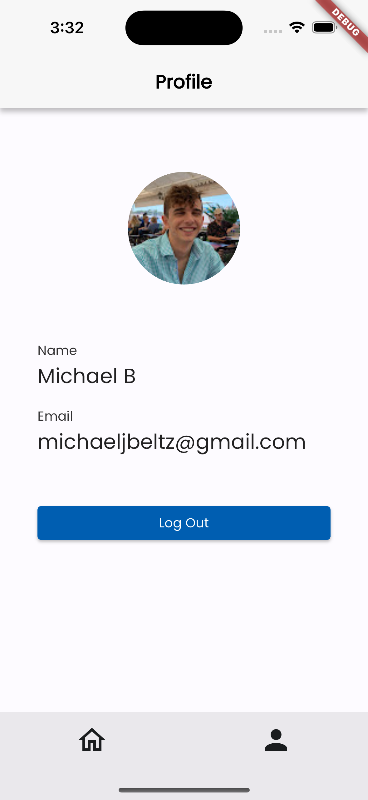
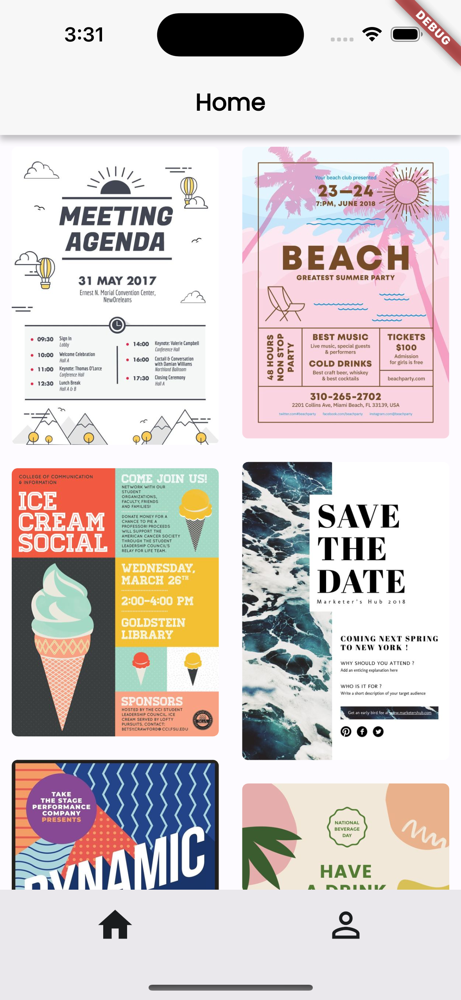
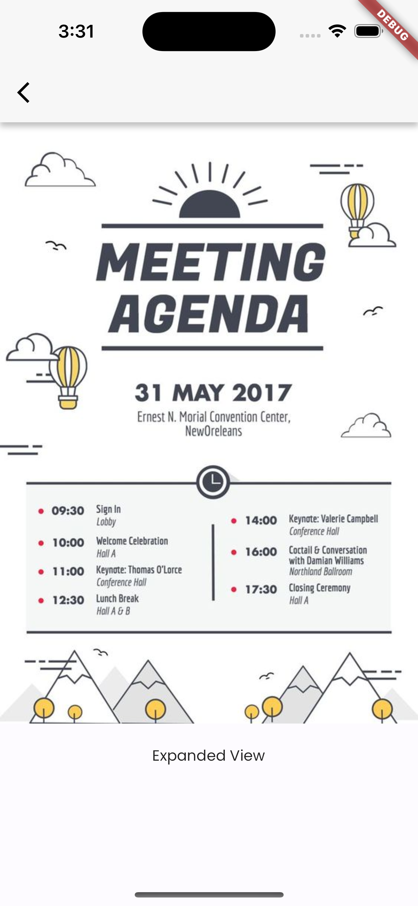

# Flyer

This is a mobile app that allows users to view flyers. 

## Stack
It is build with **Flutter** to work across diffent mobile platforms and **Firebase** to handle authentication.

## Screenshots

   

**Login Screen > Profile Screen > Home Screen > Details Screen**
